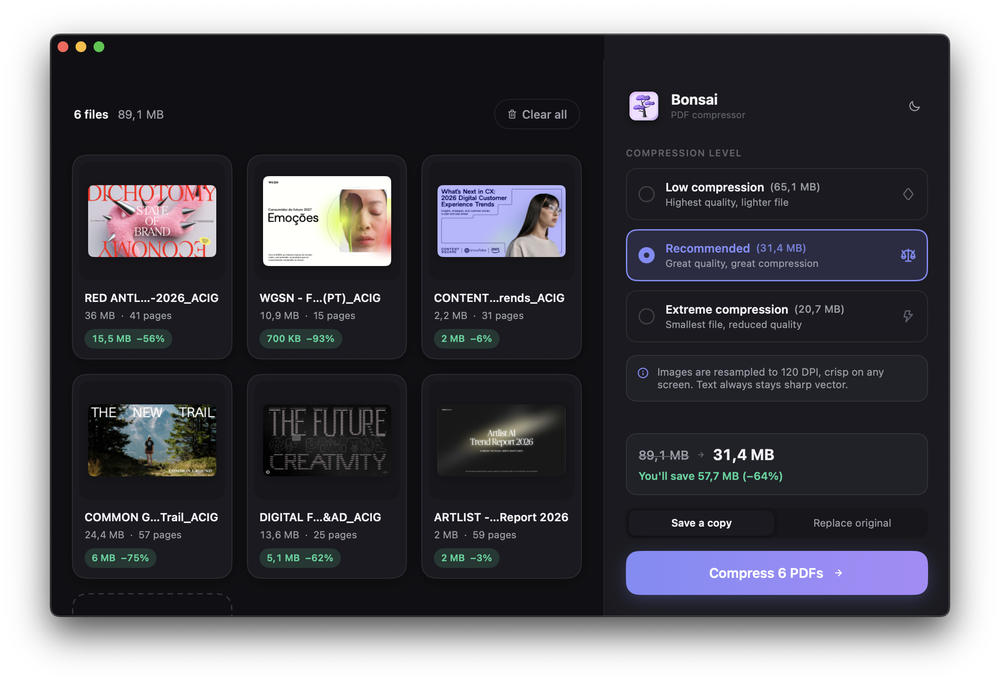

# Bonsai

**Compress PDFs. Keep the quality. Never leave your Mac.**

Bonsai is a tiny native macOS app that shrinks PDF files the way the big web services do, except everything happens locally. No uploads, no accounts, no size limits, no subscription. Drop files, see exact savings before you commit, press one button.



## Why another PDF compressor?

- **100% local and private.** Your documents never touch a server.
- **Honest numbers.** Bonsai doesn't guess: it actually compresses in the background while you choose a preset, so the size you see is the size you get. Saving is instant.
- **Nothing breaks.** Text stays razor-sharp vector (never rasterized). Links, annotations, form fields (with values), outlines and page rotations all survive. Verified by an automated hostile-PDF test suite.
- **Never inflates.** If compression wins less than 2%, you get your original bytes back, labeled "Already optimized".
- **Real-world results.** A 70 MB design-tool export (168 JPEG-with-alpha images) compresses to 18 MB on Recommended and 11 MB on Extreme, matching the popular web compressors on the same file.

## Presets

| Preset | Images | Result on a real 67 MB design export |
|---|---|---|
| **Low compression** | 200 DPI, JPEG QFactor 0.40 | 38 MB (-43%), visually lossless |
| **Recommended** | 120 DPI, QFactor 1.10 | 18 MB (-73%), crisp on any screen |
| **Extreme** | 72 DPI, QFactor 1.30 | 11 MB (-84%), fine for email |

Judge for yourself: click any file for a before/after slider at full resolution.

## Features

- Batch compression: drop a whole folder's worth of PDFs at once
- Live per-file savings badges plus total savings, computed for real
- Before/after comparison slider with per-page navigation
- Day / Night theme (Shift-Cmd-D), animated everything
- "Save a copy" (default) or "Replace original" (original goes to Trash, recoverable; the swap is staged so a failed save can never lose your file)
- Password-protected and broken files are detected and skipped gracefully
- Drag PDFs onto the Dock icon, or use Cmd-O

## The engine

Bonsai has two compression backends and always delivers the smallest valid result:

1. **Ghostscript** (used automatically when installed): re-encodes and downsamples every image class, including JPEG-with-transparency pairs from design tools (Figma, Sketch, Keynote exports) that Apple's frameworks refuse to touch. This is the same technology class the big web services run on their servers.
2. **Native fallback** (PDFKit + Quartz filters, zero dependencies): solid on scans and photo PDFs, weak on transparency-heavy exports.

Either way the output is validated (readable, same page count) and compared against the original; the worse result is discarded. Ghostscript runs as a separate process, so the app itself stays MIT-licensed.

For transparency-heavy design exports (Figma, Sketch, Keynote decks) Bonsai switches to a structure-preserving mode: page content, text, vectors and transparency stay byte-identical, only oversized embedded JPEGs are decoded, downsampled and re-encoded in place. Such files render exactly like the original in every viewer, including mobile ones, which choke on rewritten transparency.

There is also a visual safety net: every compressed page is rendered with Apple's own PDF renderer and compared against the original (5x5 tile color means). Pages that come out structurally different, for example soft-masked mesh gradients that Ghostscript re-serializes in a way Preview renders as flat or black fills, are spliced back byte-exact from the original file using qpdf. You keep the compression on every healthy page and the original pixels on the fragile ones.

## Install

Grab the zip from the [latest release](https://github.com/finkoegor/Bonsai/releases/latest), unzip and drop Bonsai.app into /Applications.

The build is not notarized by Apple, so macOS will block the first launch. Either allow it in System Settings, Privacy and Security, "Open Anyway", or clear the quarantine flag in Terminal:

```bash
xattr -d com.apple.quarantine /Applications/Bonsai.app
```

This is a one-time step. After that the app keeps itself fresh: updates arrive via Sparkle, signed with EdDSA, and never retrigger the prompt.

Or build from source:

```bash
git clone https://github.com/finkoegor/Bonsai
cd Bonsai
./build.sh install
```

The app lands in /Applications. After that, every plain `./build.sh` refreshes the installed copy (and relaunches it if it was running).

Requires macOS 14+. For the strong engine:

```bash
brew install ghostscript qpdf mozjpeg
```

First launch from `~/Desktop` or `~/Documents` will ask for folder access. That's the standard macOS prompt; the app only ever reads the PDFs you give it.

## Known limitations

- Color-emoji glyphs stay visually intact after compression but lose their text-extraction mapping. Cyrillic, CJK and regular text are unaffected.
- Without Ghostscript, transparency-heavy design exports barely compress (the app tells you and shows the install command).
- Encrypted PDFs are skipped; unlock them first.

## License

MIT © 2026 Egor Finko.

Third-party: [Sparkle](https://github.com/sparkle-project/Sparkle) (permissive, bundled) powers updates; icons are [Unicons by Iconscout](https://github.com/Iconscout/unicons) (IconScout Simple License); [Ghostscript](https://ghostscript.com) (AGPL) and [qpdf](https://github.com/qpdf/qpdf) (Apache 2.0) are separate programs invoked as external processes when installed via Homebrew, they are not distributed with the app.
